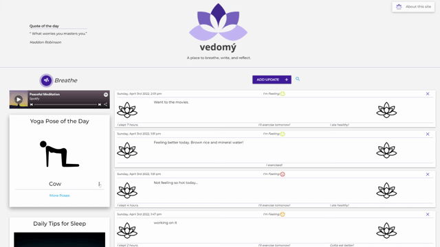

# vedomý

## A place to breathe, write, and reflect

Hey there! We've created this space for anyone who needs a second to slow down, reflect, and collect themselves.

Vedomý is Czech for "conscious", and we believe that a conscious life is a life lived in the present.

A great way to live like this is by doing exactly what this place is designed to help you to do- breathe, write, and reflect.

 - Click "Add Update" to journal about your current state, and it will be logged for future reference.

 - Use the breathe module to help slow your internal pace.

 - Check out a yoga pose, a sleep tip, or a new healthy recipe. Above all, enjoy your stay!

## Click the gif below to check out the app!

## This project uses Materialize, JQuery, Spotify Widget, and various data APIs to assist with JS, HTML, CSS in development of the app.
